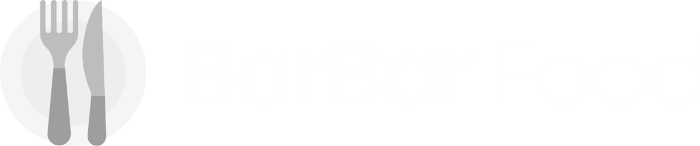
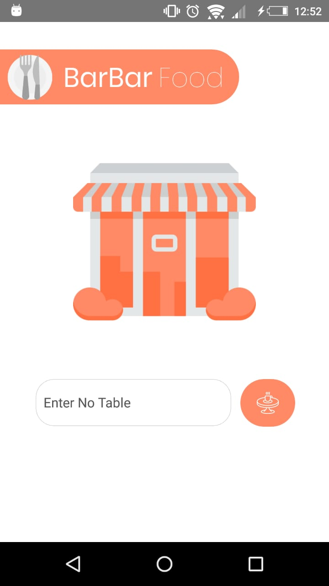
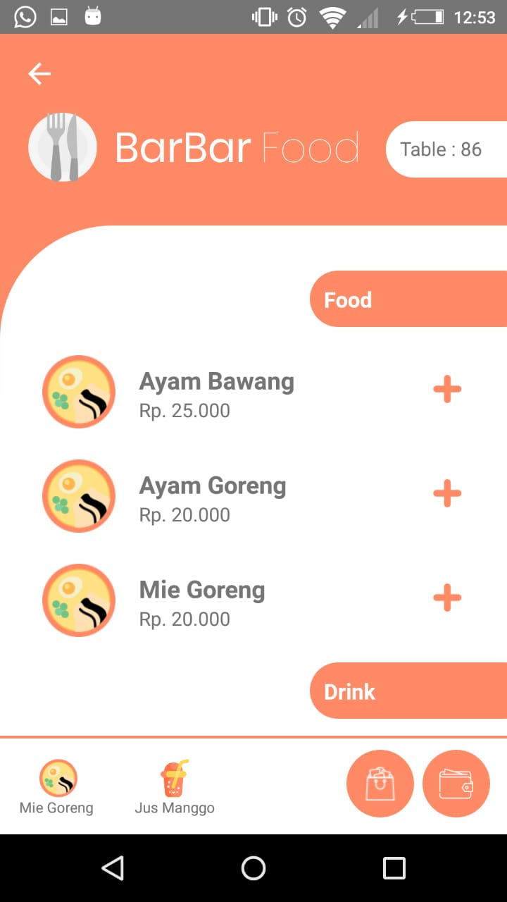
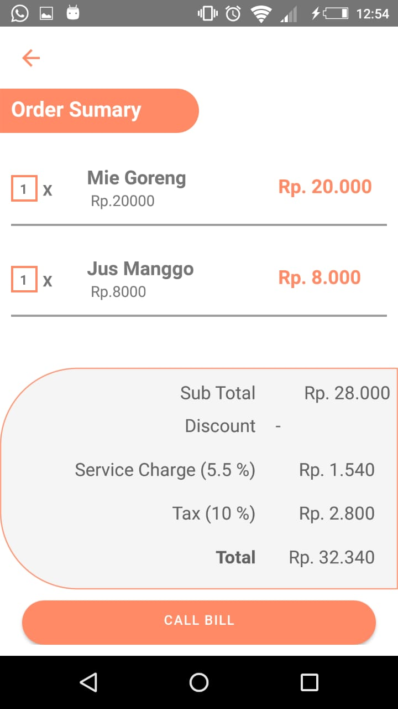
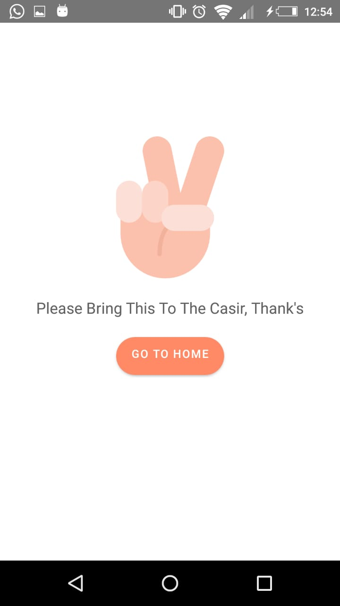

<h1 align="center">
  <br>
</h1>

## Important 

This project is still on very early development stage. If you want to use for production, use it with your own risk.
<br>More feature Coming Really Soon.

## BarBar Food

BarBar Food Is an Aplication for Everyone Choose Food 

## Screenshots

<p float="left">
  

  

  

  
</p>

## Fitures

- Choose Table
- Choose Trancation
- Detail Transaction
- Point Of Sale Aplication

## Why BarBar Food

- Esay To Use this Application
- It's React Native, so it support android & iOS by default
- Express is one of the most starred javascript framework, and it is very easy to use

## Tech Stack

- React Native for the Mobile Frontend
- Node + Express Js for the Backend

## Prerequisites

- Make sure You had been install NodeJs in your system [https://nodejs.org/](https://nodejs.org/)
- Then install React Native [https://facebook.github.io/react-native/](https://facebook.github.io/react-native/)
- Dont forget express ad the backend [https://expressjs.com/](https://expressjs.com/)

## Installation & Configuration

follow these steps to install

### Frontend

```bash
git clone https://github.com/ilhamdani97/PointOfSaleReactNative
cd PointOfSaleReactNative
npm install
npm start
react-native run-ios #for ios
react-native run-android #for android
```

create .env file and set API_HOST as your expressUri

```env
API_URL=http://YOUR_DOMAIN:YOUR_PORT
```

### Backend

```bash
git clone https://github.com/ilhamdani97/APIPointOfSale
cd APIPointOfSale
npm install
npm install nodemon -D
npm start
```

### Support Us :)

- Stars this repository
- Hire Us

  * [Ilham Ramadani](https://www.linkedin.com/in/ilham-ramadani-a38256117/)
  ## Contact

- WA/TELEGRAM: +62 1372374345 (Ilham Ramadani)

## Download App APK (Demo usage only)
 * [BarBar Food](https://drive.google.com/file/d/1_VJjEx89h0bo1A8JakewawCjLrs_zf7K/view?usp=sharing)